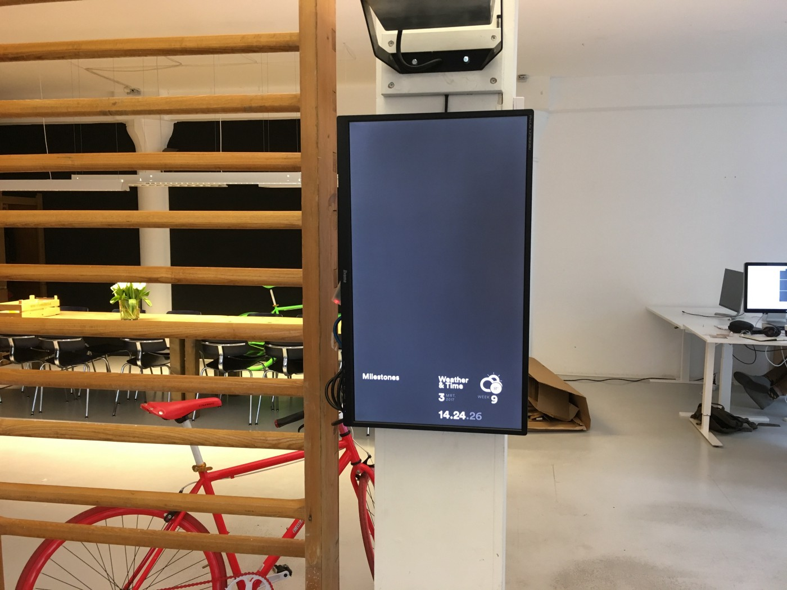
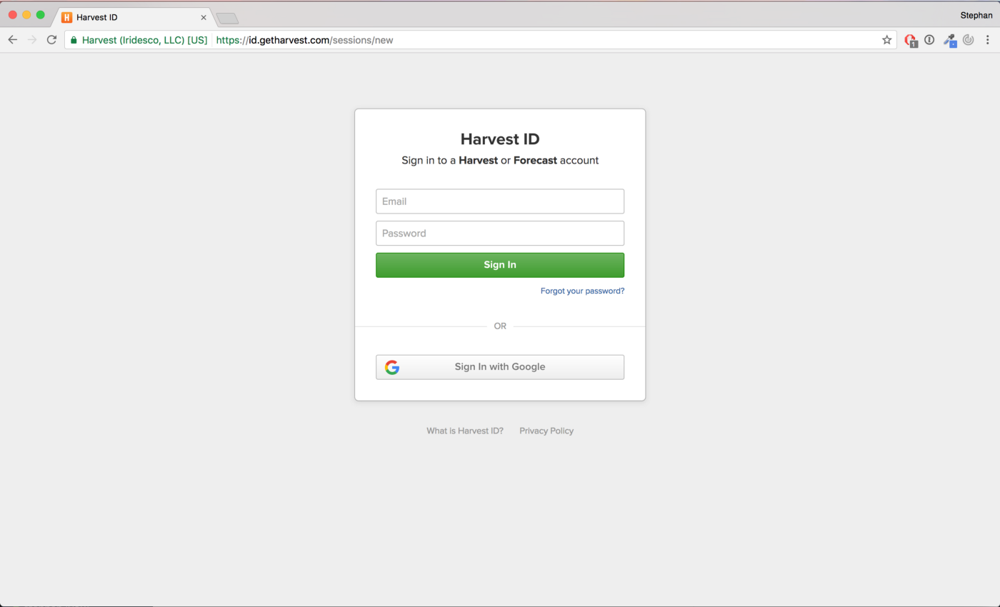
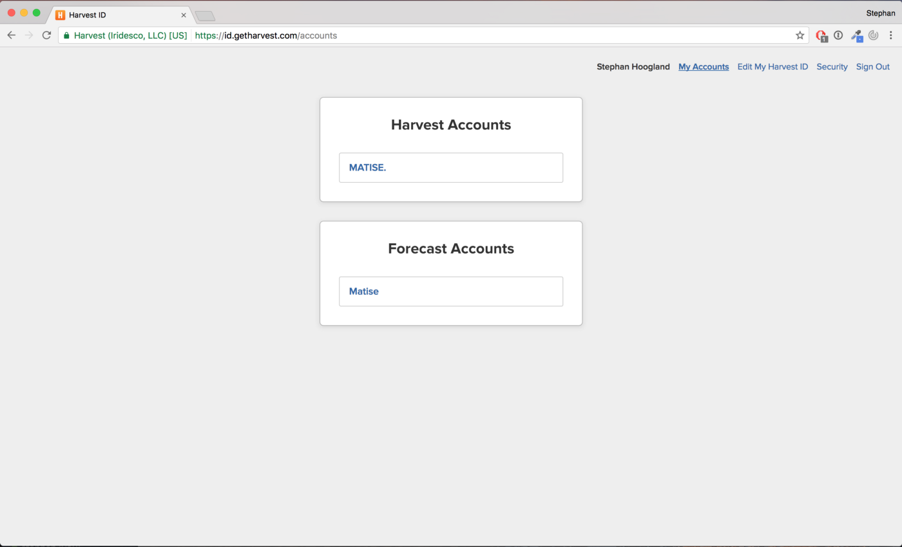
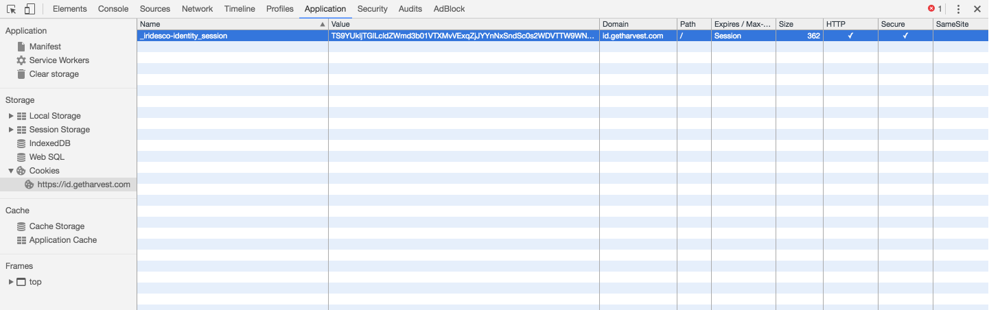
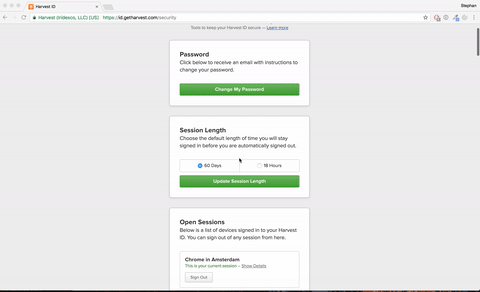

# Homemade forecast API

So, we have our planning board here at Matise. Maurits wrote all about it in [his post](https://blog.matise.nl/our-planning-board-on-a-second-screen-ab072d6e28ed) almost a year ago. Now this works great, every day everyone is able to see what he has to do for that day. But every now and then, this happens:



Which is happening because of "access tokens". More specifically because of [forecast](https://forecastapp.com) invalidating them. Maurits wrote about the 60 day expire date on the tokens, which still holds true. But does mean we had to update the planning board every 2 months. Which brought me to the point of this blogpost: can we automate this?

## The sign in flow
First things first, I started by looking at how forecast handles logging in, and where we get the access token in the progress.


Forecast login page

I started with the forecast login page. Displayed above is the Harvest ID sign in page. This is where we have to sign in automagically to get to the next page.


Forecast account select page

The above page is the result of signing in. In the HTML of the account selection page is a link which has the account ID we are looking for. This link "https://id.getharvest.com/accounts/[accountID]" is what we need for the last step. It returns a redirect with the accessToken in the target link. Looks easy enough right?

## Automating everything
Starting with the basics I recreated the sign in flow in Postman. This way I knew the steps I was taking were possible with the least amount of headers and form-data. I took our favorite web server technology, parse-server, to realize the the automation. This makes it easy to run scripts and make the requests we are going to need.

Try the requests in Postman with this [link](https://www.getpostman.com/collections/7a58cbfb4894804f5ea6).

## Part 1: The sign in page
Using postman and some trial and error I figured out that to submit user credentials to the sign in page we need the following information:

- Email
- Password
- Authenticity token
- Session cookie

The username and password are easy, thats something I know. The other 2 is where it gets interesting. If you do a GET request to https://id.getharvest.com/sessions/new it returns the following form:

```html
<form action="/sessions" accept-charset="UTF-8" method="post">
	<input name="utf8" type="hidden" value="✓">
	<input type="hidden" name="authenticity_token" value="TkxN8xY3GSk7WI+cbpM7F1lPVMFcFAJKPNyASckeUvxNNBgYGqNkSmmxmNkYRWJJvi2ycEWztsBWv/QtmmyQug==">
	<div class="field">
		<label class="is-hidden" for="email">Email</label>
		<input type="email" name="email" id="email" placeholder="Email" autofocus="autofocus" autocapitalize="none">
	</div>
	<div class="field">
		<label class="is-hidden" for="password">Password</label>
		<input type="password" name="password" id="password" placeholder="Password">
	</div>
	<input type="hidden" name="product" id="product" value="">
	<div class="field submit">
		<button name="button" type="submit" class="button button-big button-full button-primary" id="log-in">Sign In</button>
	</div>
	<div class="field meta">
		<a class="forgot-password-link" href="/password_reset/new">Forgot your password?</a>
	</div>
</form>
```

If you look at the second `<input>` tag we found the authenticity_token. And when we look at the cookies in the inspector we find the _iridesco-identity_session.



Combining this knowledge with some [npm](https://www.npmjs.com/) libraries ([request](https://www.npmjs.com/package/request), [cheerio](https://www.npmjs.com/package/cheerio)) we get the following script which returns the authenticity token and captures the cookie session.

```javascript
let cheerio = require('cheerio');
let npmRequest = require('request');

let authenticityToken;
let j = npmRequest.jar();

let options = {
	jar: j,
	method: 'GET',
	url: 'https://id.getharvest.com/sessions/new'
}

npmRequest(options, (error, response, body) => {
	let $ = cheerio.load(body);

	authenticityToken = $('body form input[name=authenticity_token]').attr('value');
});
```

As you can see we end up with the authenticityToken in a variable and the session neatly taken care of by the request cookie jar ("npmRequest.jar()").

The cookie jar is a very useful tool. Sadly it took me a while to figure this out. If you don’t create a new instance of the cookie jar, request uses some hidden global storage object to store your cookies. This resulted in me being very frustrated with the fact that it was working in my postman calls but not in my javascript code.

## Part 2: Signing in
With the information gathered from the sign in page and a email and password we can create the following request.

```javascript
let options = {
	jar: j,
	method: 'POST',
	url: 'https://id.getharvest.com/sessions',
	formData: {
		authenticity_token: authenticityToken,
		email: email,
		password: password
	},
	followAllRedirects: true
};

npmRequest(options, (error, response, body) => {
	//Logged in session in the cookie jar
});
```

Now we have a logged in session token in the cookie jar.

## Part 3: Access Token
The final requests gets the access token that we are looking for. With some fancy regex code I get the accountId and accessToken out of the link.

```javascript
var options = {
	jar: j,
	method: 'GET',
	url: 'https://id.getharvest.com/accounts/123456',
	followRedirect: false
};

npmRequest(options, (error, response, body) => {
	var regex = /https:\/\/forecastapp.com\/(.*)\/access_token\/(.*)\?/;
	var m = regex.exec(response.headers.location);

	accountId = m[1];
	accessToken = m[2];
});
```

The /accounts/[accountId] endpoint returns a 302 redirect with the link we need in a location header. With the regex shown above I simply extract the accountId and accessToken for further use.

## Using the code
After combining all the requests with some Parse.Promise magic I created a hourly Parse job. Which if you are interested I shared as a [gist on github](https://gist.github.com/SHoogland/c9a7bf9622583d78a3d3223d5c9f6e53).

## Afterthoughts
Now we have the accesstoken in a database. We can do some cool stuff with it. For example we are thinking of fetching a fresh token every day when the planning board launches, so we never have to update the code of the planning board again.

Side note:



I have the automated sign in running every hour to keep my access token fresh. But when I went to the Harvest ID security page, I noticed the ridiculous amount of sessions I created. Once we implement the code in the planning board I am probably turning the access token expire age to 18 hours instead of 60 days, so there will never be more than 18 active sessions.

<disqus />
