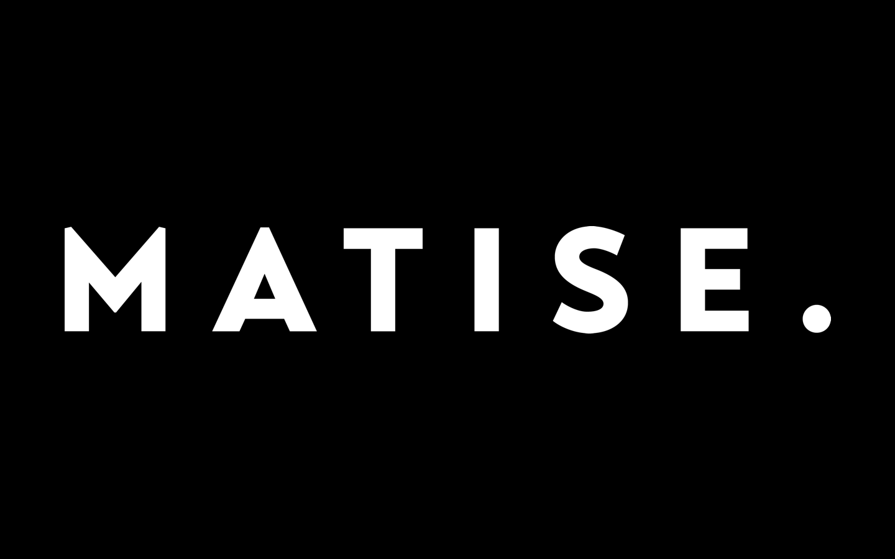
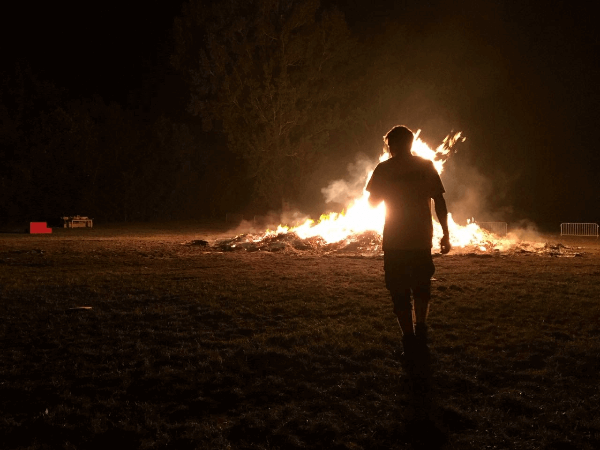
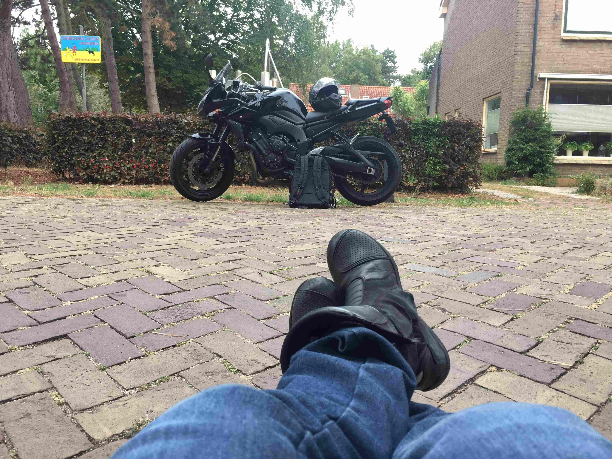

# About Me

Stephan Hoogland

That's me, a humble and epic backend developer, who can not seem to get interested in frontend code (css and everything that has to do with styling), hence the default vuepress theme site you are looking at right now.

This is my so called blog, I'm more and more writing down tech projects I try and was in need of a place to store and organize those documents.

## Profiles

- [Github](https://github.com/shoogland)
- [Twitter](https://twitter.com/s_hoogland)
- [Instagram](https://instagram.com/s_hoogland)

## Work

I currently work for [Matise](https://matise.nl)

## Hobbies

I wanted to add some images that tell a little bit about me:

I like to create a fire every now and then, this was a rather big one...

I drive to work on this piece of art (Yamaha FZ1 2011)
